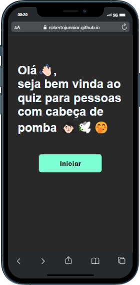

## Projeto - Quiz para estudos de uso do JS

Projeto simples, utilizando apenas lógica básica para demonstrar a uma parceira de estudos como é possível manipular e criar situações com o básico de JS, sem eventos ou funções de código complexas para quem está iniciando nos estudos de JavaScript.

O script é repetitivo, mas funciona em cascata para que ela se adapte a leitura, assim podendo criar as próprias lógicas, adicionar mais perguntas, botões e modificar o arquivo conforme for entendendo.

## Acesso ao Quiz 👩🏻

Clique na imagem para acessar o Quiz:

## Tecnologias

<ul>
<li>Html</li>
<li>CSS</li>
<li>JavaScript</li>
<li>Github</li>
</ul>
